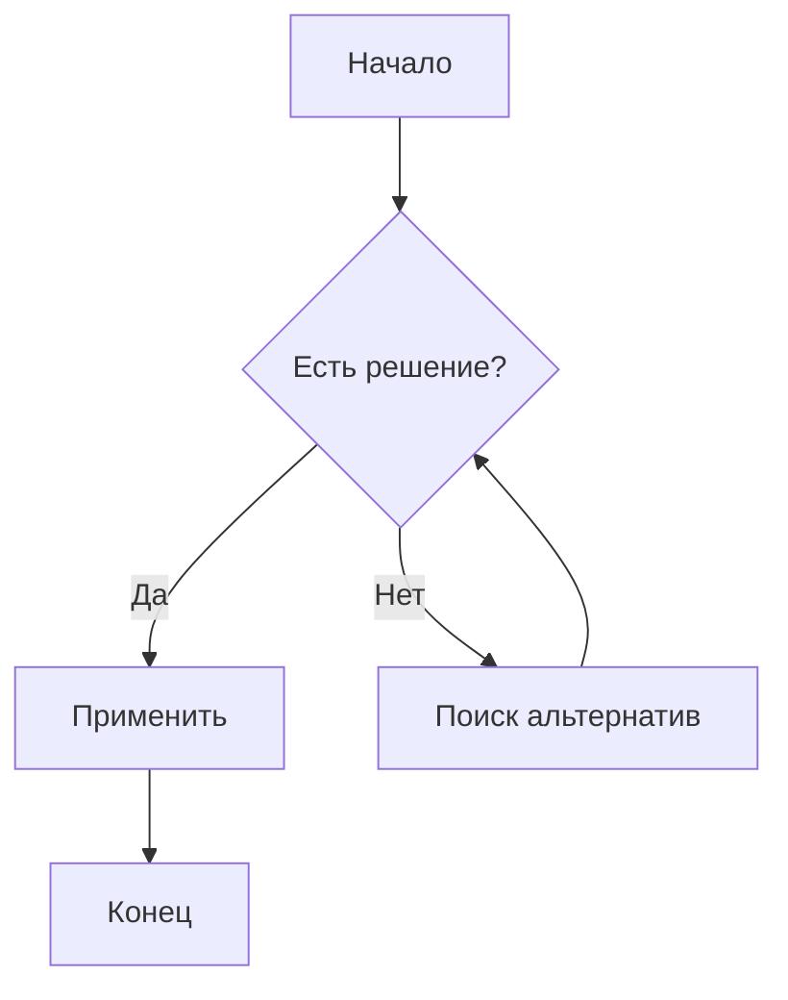
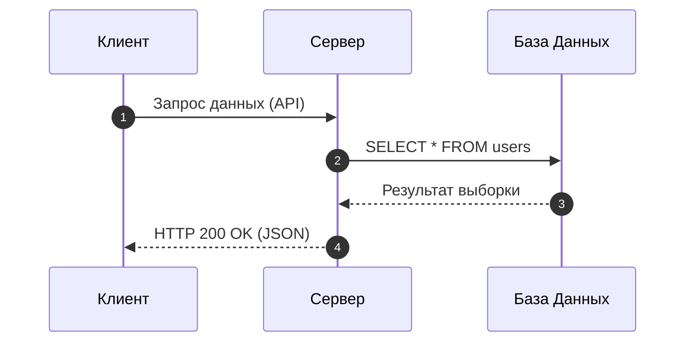
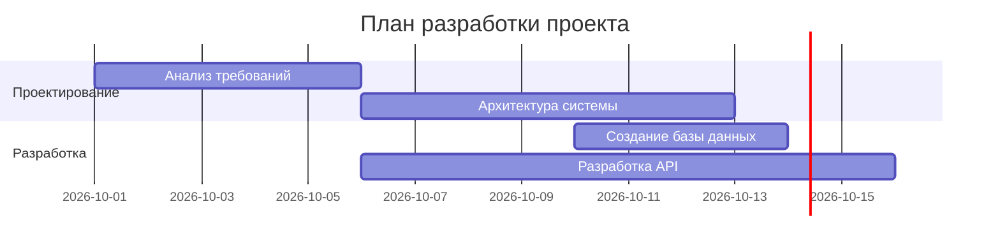
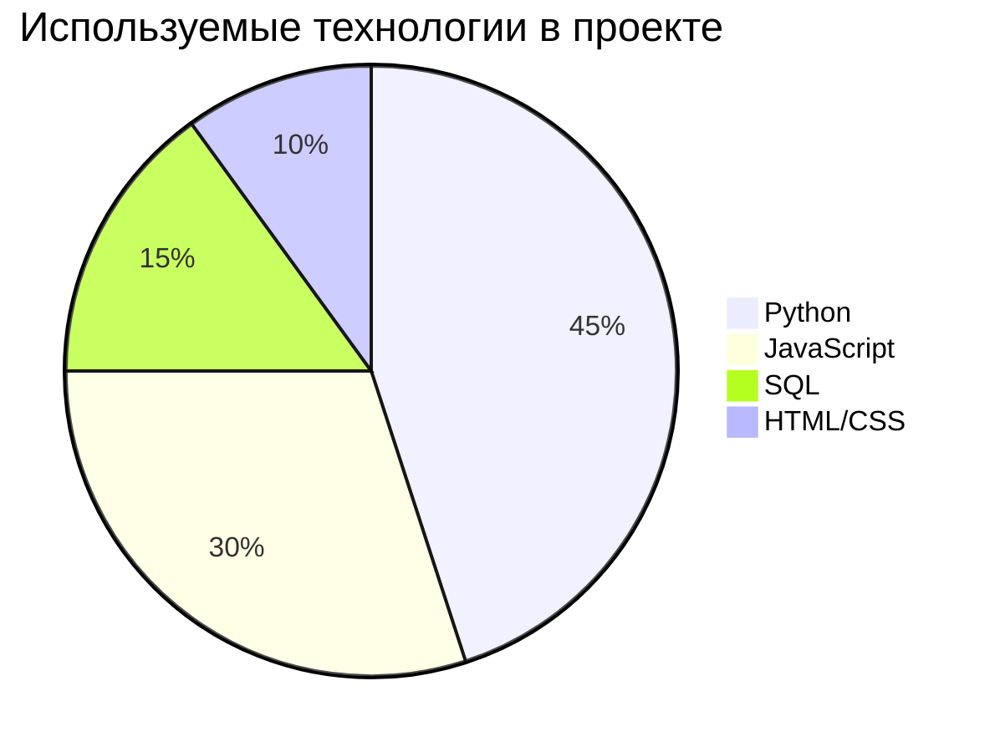
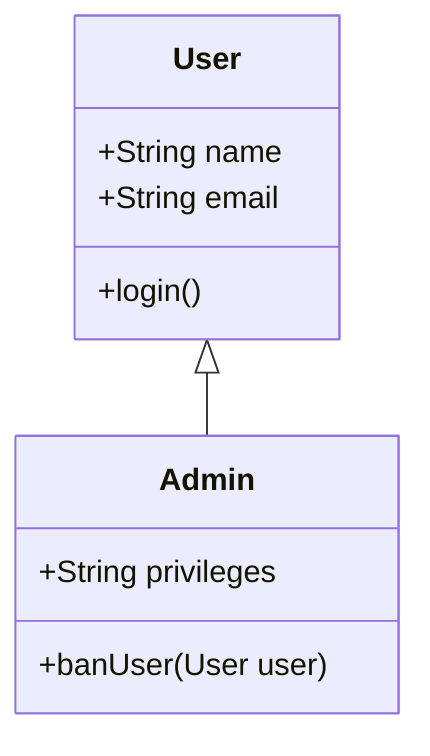
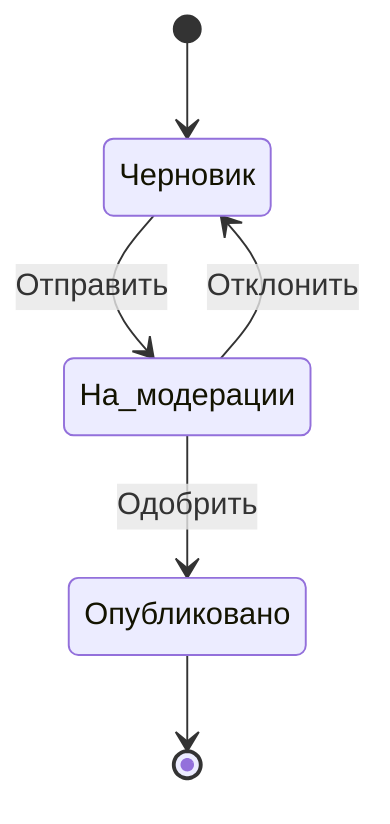
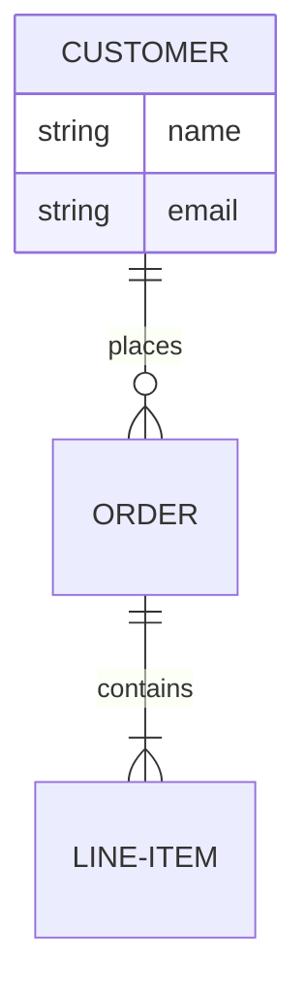
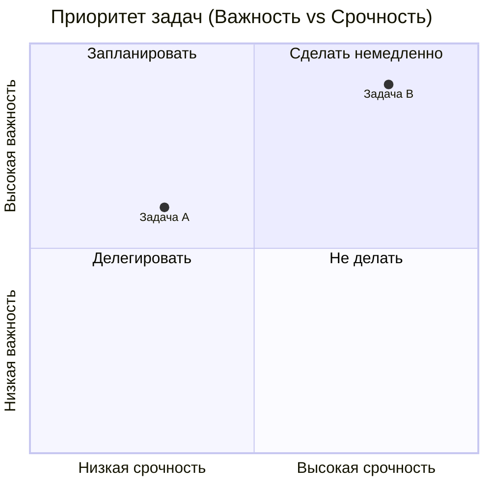
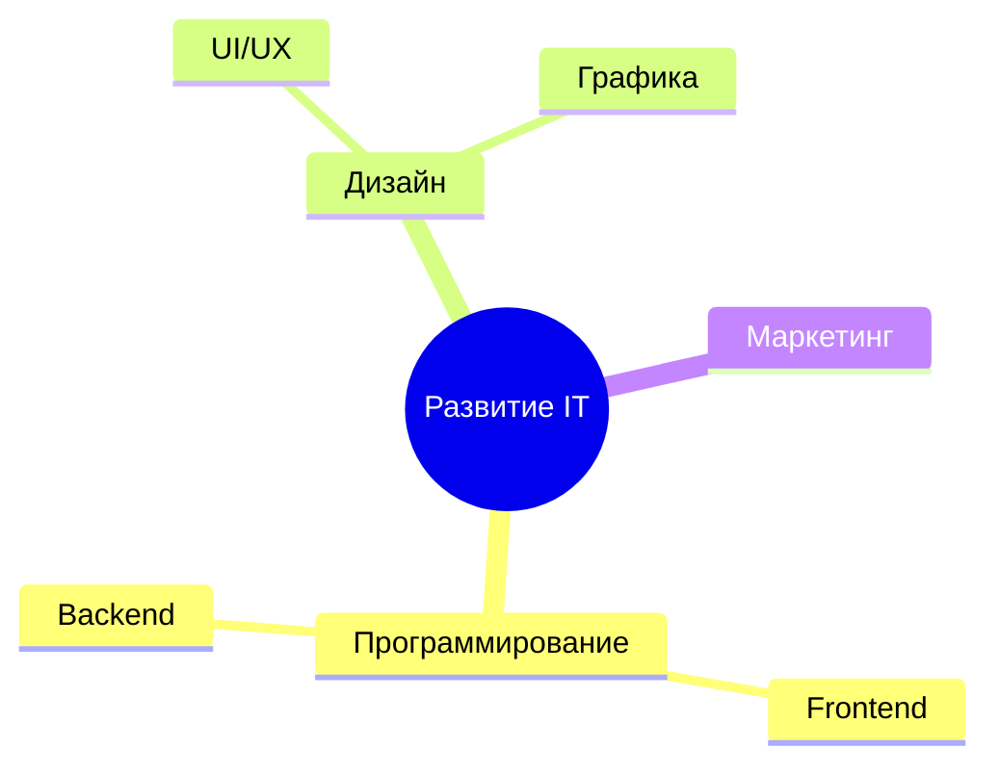

# Примеры диаграмм Mermaid

В этом файле собраны основные типы диаграмм, графиков и блок-схем, поддерживаемых в **Mermaid**.

---

## 1. Блок-схема (Flowchart)

---

## 2. Диаграмма последовательности (Sequence Diagram)

---

## 3. Диаграмма Ганта (Gantt Chart)

---

## 4. Круговая диаграмма (Pie Chart)

---

## 5. Диаграмма классов (Class Diagram)

---

## 6. Диаграмма состояний (State Diagram)

---

## 7. Диаграмма Entity Relationship (ER-диаграмма)

---

## 8. Квадрант-граф (Quadrant Chart)

---

## 9. Ментальная карта (Mindmap)

